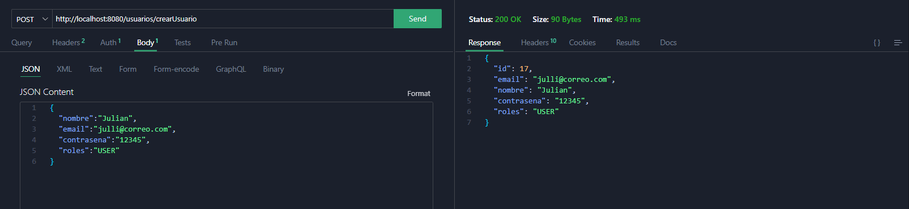
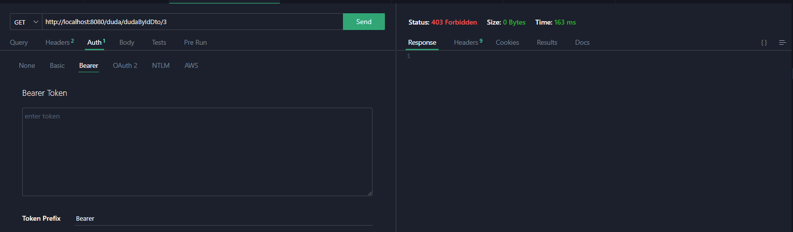
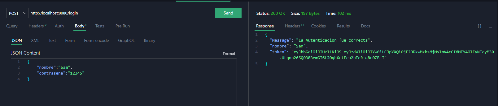
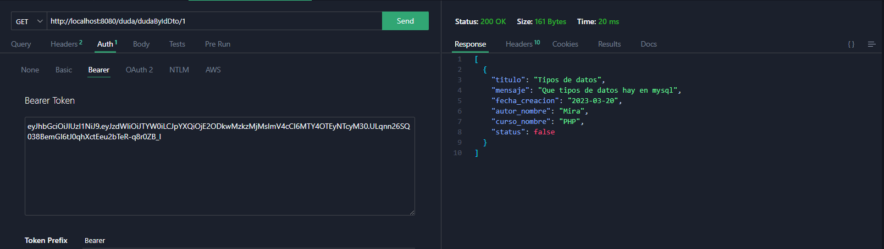
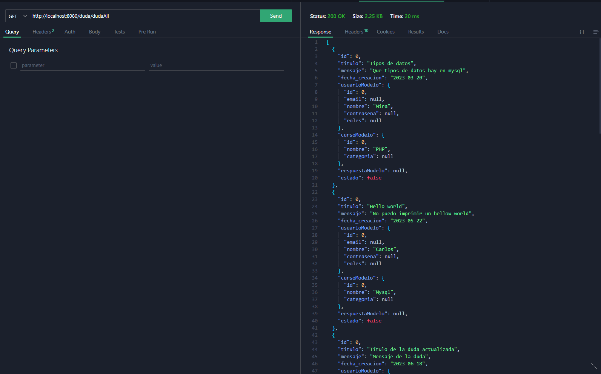
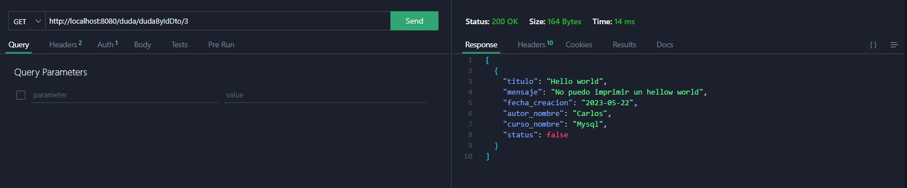
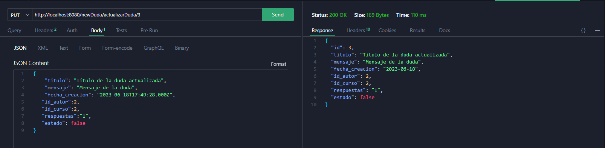
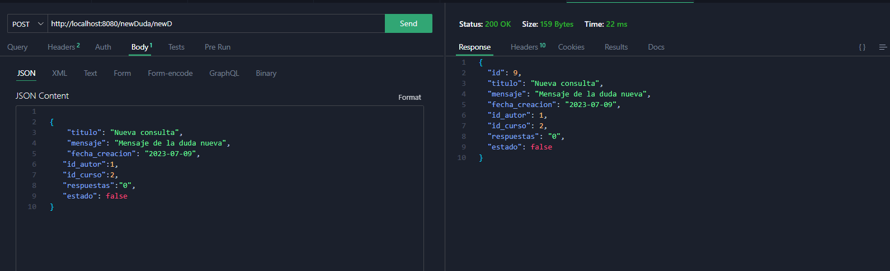
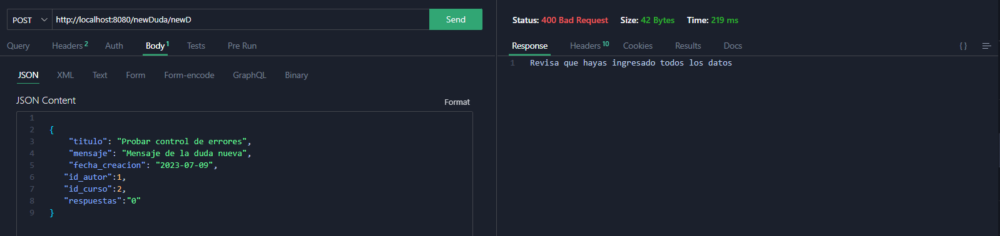
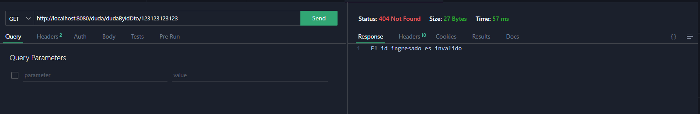

# Challenge ONE | Back End | Foro Alura

Aquí presento mi solución al reto propuesto por parte de Alura Latam en la formación Backend, en el cual se nos pidió que hiciéramos una API REST, en la cual trabajara con el foro de Alura, donde podremos plasmar nuestras dudas referentes a los temas tratados en las clases.

(Para obtener más información, revise el código y los comentarios.)

## Requerimentos

- Crear una publicación donde vengan las dudas de los usuarios.

- Estas tienen que estar relacionadas con algún curso dentro de la plataforma.

- Mostrar todas las publicaciones creadas.

- Mostrar publicaciones por medio de un ID.

- Actualizar los datos de una publicación.

- Eliminar una publicación.

- Manejo de excepciones.

## Requisitos de Seguridad

- Autenticación con usuario y contraseña.

- Manejo de contraseñas con encriptación BCrypt Password Encoder.

- Asignar rol a cada usuario.

- Autorización JSON Web Tokens (JWT).

### Tecnologías usadas

| VsCode     |      |
| ---------- | ------------------------------------------------------------------------------------------- |
| Java       |      |
| MySql      |    |
| SpringBoot |  |

## EndPoints

| EndPoints                 | Descripcion                                              | Rol                   | Metodo |
| ------------------------- | -------------------------------------------------------- | --------------------- | ------ |
| /duda/dudaAll             | Permite ver todas las consultas de los usuarios.         | INVITED, USER y ADMIN | Get    |
| /duda/dudaByIdDto/{id}    | Permite ver las consultas filtradas por ID.              | INVITED, USER y ADMIN | Get    |
| /newDuda/newD             | Permite crear una consulta                               | USER y ADMIN          | Post   |
| /newD/actualizarDuda/{id} | Permite actualizar o cambiar los valores de la consulta. | USER y ADMIN          | Put    |
| /newD/deletDuda/{id}      | Permite borrar la consulta.                              | USER y ADMIN          | Delete |
| /usuarios/crearUsuario    | Permite crear un nuevo usuario.                          | INVITED y ADMIN       | Post   |

## Aplicación

#### Registro de usuario

Creamos un usuario con los datos solicitados.

#### Búsqueda sin token

Intentamos acceder sin haber obtenido previamente un token y nos arroja un error.

#### Autenticación y autorización con token

Realizamos la autenticación y obtenemos autorización mediante el token.

Ingresamos el token y obtenemos acceso a las consultas.

#### Búsqueda de todas las consultas.

Aquí ya podemos realizar búsquedas, sin embargo, nos arrojan información innecesaria en este caso en particular.

#### Búsqueda con ID.

En este caso, podemos realizar una búsqueda de consulta por medio de un ID y, aplicando un patrón DTO (Objeto de Transferencia de Datos), podemos evitar enviar información innecesaria en la respuesta.

#### Actualizar consulta

En el punto anterior, buscamos la consulta con ID 3. Aquí la actualizamos y podemos ver que mantiene el mismo ID.

#### Creación de consulta.

Creamos una nueva consulta.

#### Control de errores.

Ejemplos del manejo de excepciones.

Aquí tenemos un ejemplo donde queremos crear una nueva consulta, pero 
nos falta el campo de "estado", el cual indica que la duda creada aún no
 tiene una respuesta final. Al no ingresar este dato, nos arroja un 
error.

En este ejemplo, estamos buscando un ID inexistente y nos arroja un error diciendo que el ID es inválido.

##### Agradecimientos

- **ONE – Oracle Next Education**

- **Alura**

Trabajo realizado por [Gerardo Sanchez](https://www.linkedin.com/in/gerardosm)

 
